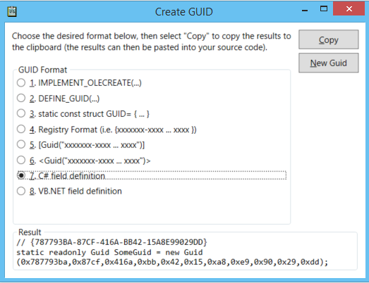
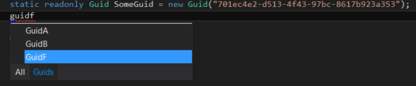

# GuidGen

A GuidGen tool similar to the one that ships with VS, but less than a decade old.

GuidGen 2.0 is a new face to creating GUIDs. And includes C#/VB code snippets!

It's also [open source](https://github.com/AArnott/GuidGen)!

But a separate app to copy GUIDs from into the editor is still old school. Why not have inline editor completions for GUIDs? Just type "guid" in your C# or VB code files, then click on "Guids" or press Alt+. to select the Guids tab with the keyboard.

**Note**: The in-editor code completion feature has been temporarily disabled because it has some negative interactions with the language service that I haven't sorted out yet.

Let me know your feedback! Should we get this into a future version of VS?

## Installation

Download [the Visual Studio extension from the Visual Studio Gallery][1].

 [1]: https://visualstudiogallery.msdn.microsoft.com/e00f525e-50cc-4c42-85a0-73519ee289b1
